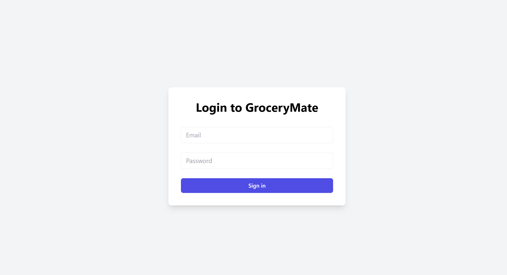
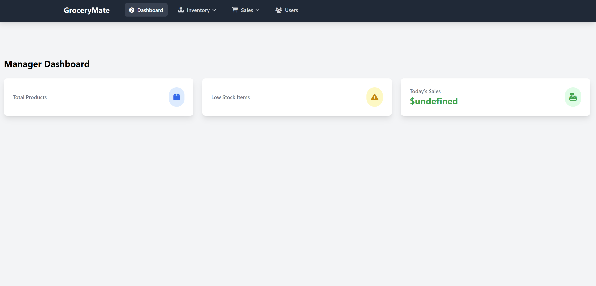
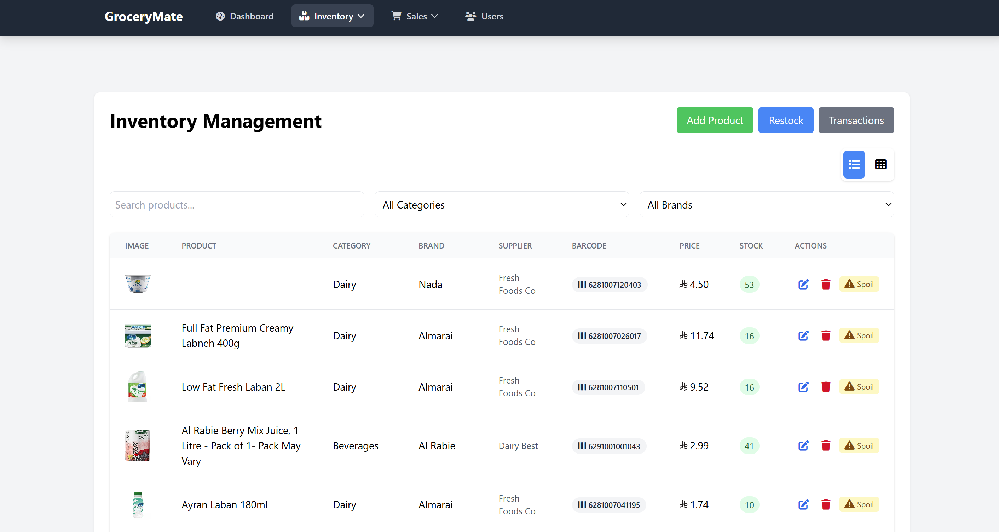
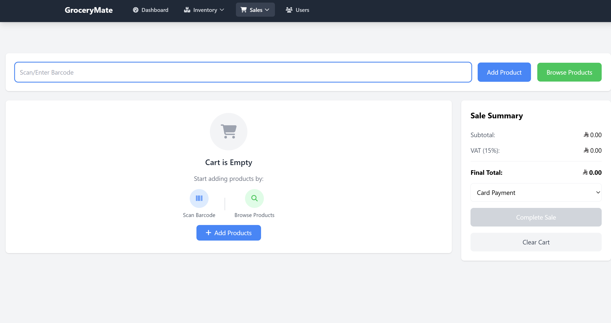

# GroceryMate Frontend

A modern React-based interface for managing grocery store operations.  
This frontend connects to a backend ASP.NET Core API and provides user authentication, inventory management, sales transactions, and dashboard analytics for grocery stores.

---

## Key Features

- **User Authentication & Role-Based Access**
  - Secure login with JWT tokens
  - Manager and Employee roles with tailored access

- **Sales Transactions**
  - Cart management and checkout flow
  - Payment methods (cash/card)
  - Invoice generation and printing

- **Product & Inventory Management**
  - Browse, add, edit, and delete products
  - Low stock warnings and spoilage/restock actions
  - Category and brand filtering

- **Dashboard UI**
  - Key metrics: total products, low stock, daily sales
  - Recent transactions and sales trends (charts)

- **Barcode Scanning**
  - Add products to cart via barcode (if supported by backend)

- **Modern UI**
  - Responsive design with Tailwind CSS
  - Routing via React Router
  - Reusable components and modals

---

## Tech Stack

- **React** (^19.1.0)
- **React Router DOM** (^6.30.1)
- **Axios** (^1.10.0)
- **Tailwind CSS** (^3.4.1)
- **Chart.js** (^4.5.0) & **react-chartjs-2** (^5.3.0)
- **React Modal** (^3.16.3)
- **@fortawesome/fontawesome-free** (^6.7.2)
- **@headlessui/react** (^2.2.4)
- **html5-qrcode** (^2.3.8)
- **jsbarcode** (^3.12.1)
- **Context API** (cart state management)
- **Vite** (^7.0.3) for build tooling

---

## Project Structure

```
src
├── api/
│   └── api.js
├── assets/
│   └── react.svg
├── components/
│   ├── Dashboard/
│   │   ├── ManagerDashboard.jsx
│   │   ├── EmployeeDashboard.jsx
│   │   ├── index.js
|   |   └── Charts/
|   ├── common/
|   |
│   ├── Inventory/
│   │   ├── InventoryList.jsx
│   │   ├── InventoryAdd.jsx
│   │   ├── InventoryEdit.jsx
│   │   ├── Restock.jsx
│   │   ├── Spoilage.jsx
│   │   ├── InventoryCount.jsx
│   │   ├── StockHistory.jsx
│   │   ├── Suppliers.jsx
│   │   └── index.js
│   ├── Reports/
│   │   ├── SalesReport.jsx
│   │   ├── InventoryReport.jsx
│   │   ├── PaymentsReport.jsx
│   │   ├── SupplierReport.jsx
│   │   └── index.js
│   ├── Purchasing/
│   │   ├── PurchaseOrders.jsx
│   │   ├── Receiving.jsx
│   │   └── index.js
│   ├── Manage/
│   │   ├── Users.jsx
│   │   ├── Roles.jsx
│   │   ├── Discounts.jsx
│   │   ├── Promotions.jsx
│   │   ├── Branches.jsx
│   │   ├── Devices.jsx
│   │   ├── Login.jsx
│   │   └── index.js
│   └── 
├── context/
│   └── 
├── main.jsx
├── App.jsx
├── index.css
├── routes.js
├── navConfig.js
├── utils/
│   ├── auth.js
│   ├── dateUtils.js
│   └── helpers.js

public/
├── sounds/
│   └── beep.mp3
docs/
├── screenshots/
│   ├── login.png
│   ├── dashboard.png
│   ├── inventory.png
│   └── sales.png
.env.example
```

---

## Getting Started

### Prerequisites

- [Node.js](https://nodejs.org/) (v18 or newer)
- [npm](https://www.npmjs.com/)

### Installation

```bash
npm install
```

### Running the App (Development)

```bash
npm run dev
```

### Building for Production

```bash
npm run build
```

---

## Environment Variables

Create a `.env` file in the project root. Example:

```env
REACT_APP_API_URL=http://localhost:5125/api
```

- `REACT_APP_API_URL`: Base URL for the backend ASP.NET Core API

---

## Available Scripts

- `npm run dev` — Start development server
- `npm run build` — Build for production
- `npm run lint` — Lint code
- `npm run preview` — Preview production build

---

## API Integration

- Communicates with the backend via REST API (`http://localhost:5125/api`)
- Uses JWT tokens for authentication (stored in `localStorage`)
- All requests except login require `Authorization: Bearer <token>`
- See [Back-End-Documentation.md](./Back-End-Documentation.md) for API details

---

## Screenshots

<!-- Add screenshots of the UI here -->
| Login | Dashboard | Inventory | Sales |
|-------|-----------|-----------|-------|
|  |  |  |  |

---

## License

MIT License

---

## Contributing

Contributions are welcome!  
Please open issues or submit pull requests for improvements.

---

## Acknowledgments

- [React](https://react.dev/)
- [Tailwind CSS](https://tailwindcss.com/)
- [Chart.js](https://www.chartjs.org/)
- [ASP.NET Core](https://learn.microsoft.com/en-us/aspnet/core/)
